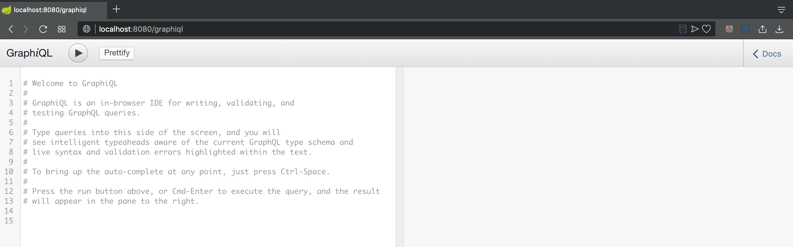
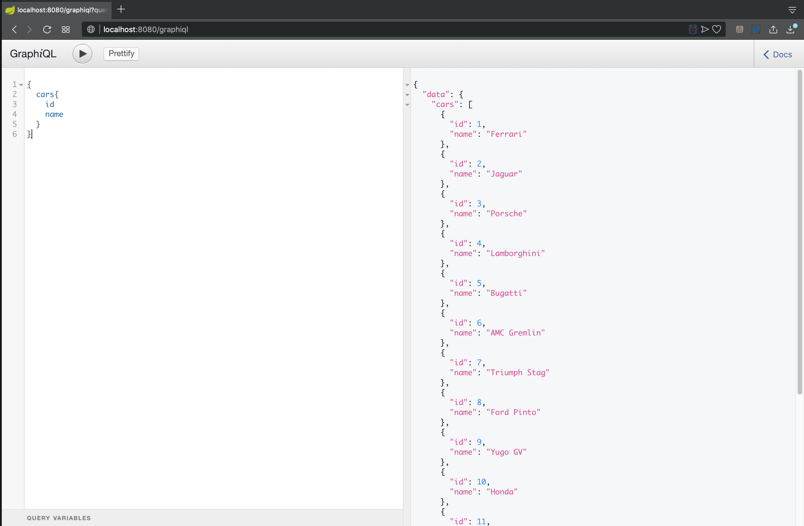
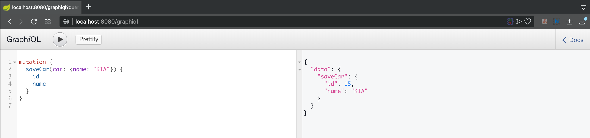
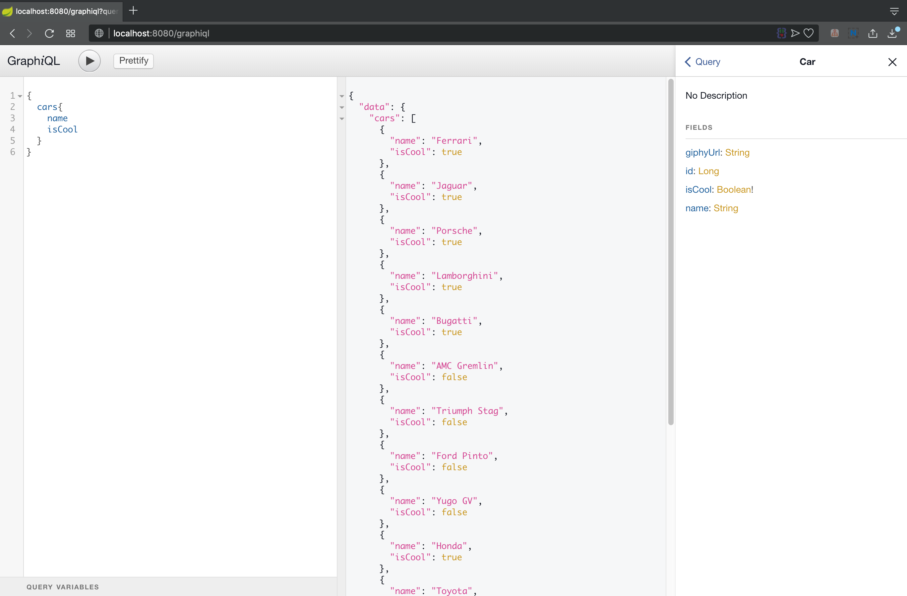
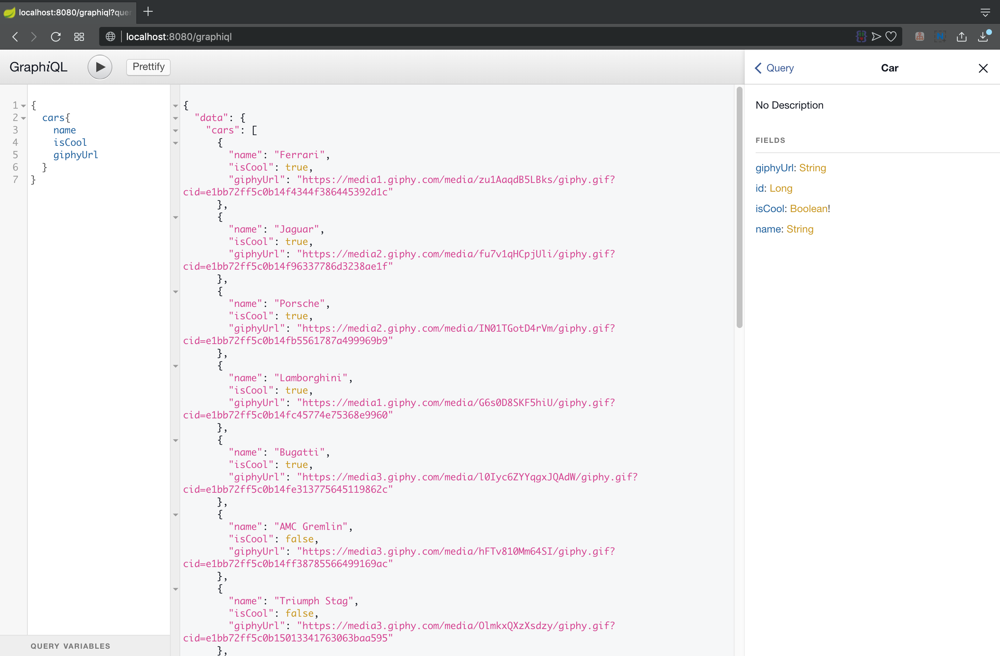

# spring-boot-graphql-sqqr-example

Run this project by this command : `mvn clean spring-boot:run`

### Screenshot

GraphiQL Welcome Message

Home Page

Save Car Page

Cool Cars Page

Giphy Url Page

